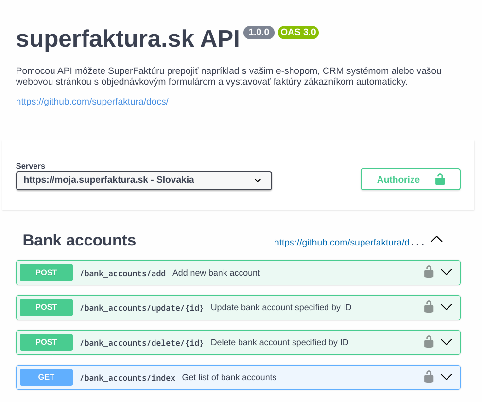

# Superfaktura OpenAPI



This specification has been manually created using available [documentation],
but it's possible that there are errors or missing new features as the API
evolves over time. I'm making an effort to keep it up to date.

[documentation]: https://github.com/superfaktura/docs

A snapshot of the upstream documentation used for the last sync is vendored in
[`docs/superfaktura`](docs/superfaktura) (commit `cac0402`, 2026-05-25).

I would greatly appreciate any contributions or updates to the OpenAPI file to
address any issues.

# Auth

See [documentation][auth-documentation] with examples.

[auth-documentation]: https://github.com/superfaktura/docs/blob/master/intro.md#authentication

You may also use [signature.sh](./scripts/signature.sh), which builds the
`Authorization: SFAPI ...` header and calls an endpoint. It reads `SF_EMAIL`,
`SF_API_KEY`, `SF_MODULE`, `SF_COMPANY_ID` and `SF_API_URL` from `.env` in the
repository root (copy `.env.example`, `.env` is gitignored):

```sh
cp .env.example .env   # fill in the values from Nástroje -> API prístup
./scripts/signature.sh                                  # GET /users/company_switcher
./scripts/signature.sh /invoices/index.json/listinfo:1  # GET with named parameters
```

# Validation and client generation

The scripts use [xseman/openapi-generator](https://github.com/xseman/openapi-generator)
(binary from `$OPENAPI_GENERATOR` or `openapi-generator` on PATH):

```sh
go install github.com/xseman/openapi-generator/cmd/openapi-generator@latest

./scripts/validate.sh                    # validate openapi.yaml (also runs in CI)
./scripts/generate.sh                    # typescript-fetch client -> client/ (gitignored)
./scripts/generate.sh dart-fetch client-dart
bun scripts/test-client.ts               # offline test of the generated client (also runs in CI)
```

`scripts/test-client.ts` starts a local mock server that answers with the JSON
examples from [`docs/superfaktura`](docs/superfaktura) and checks request
serialization (paths, named parameters, `Authorization`, body keys) and
response mapping. No credentials are needed.

## Using the generated TypeScript client

The generator does not apply the `SFAPI` security scheme, and the API reads
list filters as named parameters (`/invoices/index.json/listinfo:1/page:2`),
not as a query string. Configure the client with a header and a middleware
(both helpers are exported from `scripts/test-client.ts`):

```ts
import { Configuration, InvoiceApi, type Middleware } from "./client";

const namedParams: Middleware = {
    async pre({ url, init }) {
        const u = new URL(url);
        if (!u.search) return;
        const named = [...u.searchParams]
            .map(([key, value]) => `/${key}:${value.replace(/[/?#% ]/g, encodeURIComponent)}`)
            .join("");
        u.search = "";
        u.pathname = u.pathname.replace(/\/$/, "") + named;
        return { url: u.toString(), init };
    },
};

const auth = new URLSearchParams({ email: "api@example.com", apikey: "YOURKEY", module: "MyModule 1.0" });
const api = new InvoiceApi(new Configuration({
    basePath: "https://sandbox.superfaktura.sk",
    headers: { Authorization: `SFAPI ${auth}` },
    middleware: [namedParams],
}));

const list = await api.getInvoicesIndexJsonListinfo1({ page: 1, perPage: 10, type: "regular" });
```

Known limitation of the generator: `ClientData` contains both `Country`
(object) and `country` (string), which map to the same TypeScript property, so
`TYPECHECK=1 ./scripts/generate.sh` reports errors in `models/clientData.ts`.

# Swagger UI

`docs/serve.sh` serves the working copy of `openapi.yaml` in Swagger UI at
`/docs/`. Use *Authorize* and paste the whole header value
(`SFAPI email=...&apikey=...&module=...`).
